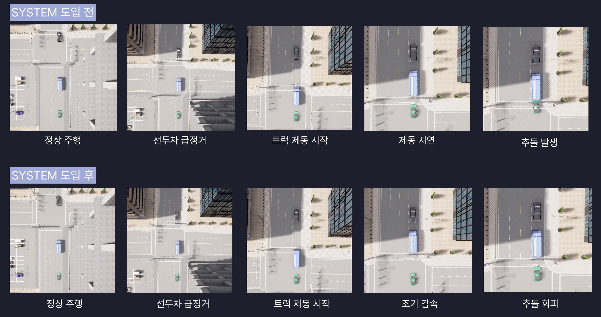
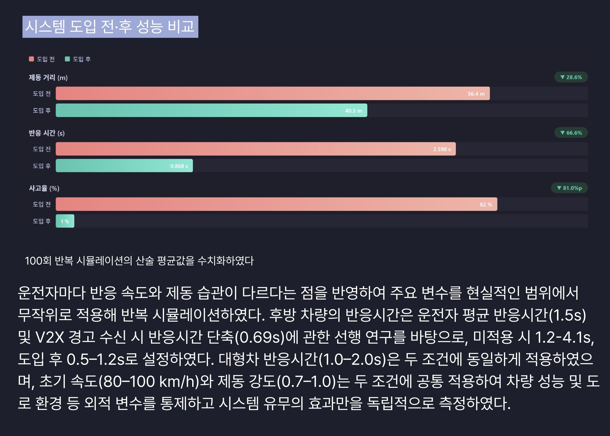

# 🚛 대형 차량 전방 시야 공유 시스템

> **후방 운전자의 시각적 단절 해소 및 인지 반응 지연 방지**  
> 2026 엔지니어링산업 경진대회 | 아이디어설계 부문 A

---

## 프로젝트 소개

고속도로에서 대형 화물차 뒤를 주행할 때, 후방 차량은 전방 상황을 전혀 볼 수 없다.
신호등·보행자·급정거 차량을 인지하지 못한 채 브레이크등만 보다 사고가 나는 구조적 문제다.

- 고속도로 사망사고 원인의 **77.8%가 안전운전 불이행**
- 대형 화물차는 후방 차량의 시야를 **3.5~4m 높이로 차단**
- 브레이크에만 의존할 경우 시속 100km에서 **제동 시작까지 28~42m 추가 이동**

이 프로젝트는 대형차 전방 카메라 영상을 **YOLOv8로 실시간 분석**하고, 위험 상황을 **C-V2X 통신으로 후방 차량에 즉시 전달**하는 V2V 시야 공유 시스템이다.
클라우드나 도로 인프라 없이 **차량 단독 엣지 AI**로 동작하는 것이 핵심 설계 원칙이다.

---

## 시스템 구조

```
[대형 화물차]
    │
    ├─ 전방 카메라 (RGB + Depth)
    │       │
    │       ▼
    ├─ Jetson Orin Nano
    │       ├─ YOLOv8 객체 탐지 (보행자 / 차량 / 급정거 / 차선변경)
    │       ├─ TTC (Time-To-Collision) 계산
    │       └─ 위험도 분류: CRITICAL(≤2s) / WARNING(2~4s) / SAFE(>4s)
    │
    └─ C-V2X 모듈 (5.9GHz) ──────────────────────────▶ UDP 브로드캐스트
                                                              │
                                                              ▼
                                                    [후방 차량]
                                                    수신 → 내비게이션 경고 표시
                                                         → HUD 직접 투영
```

### 주요 파일 역할

| 파일 | 역할 |
|------|------|
| `sender.py` | CARLA 동기 모드 실행, RGB/Depth 수신, YOLO 추론, UDP 송신 |
| `receiver.py` | UDP 브로드캐스트 수신, 위험 등급별 경고 출력 |
| `yolo_risk.py` | YOLOv8 추론 파이프라인, DetectionRisk 객체 생성 |
| `brake_detector.py` | bbox 면적 변화율·TTC 기반 급정거 감지 |
| `geometry.py` | TTC 계산, depth buffer → 미터 변환, 픽셀 역투영 |
| `config.py` | 전체 파라미터 중앙 관리 |
| `lead_vehicle.py` | 전방 차량 TTC·거리 메트릭 추출 |
| `scenario_emergency_brake.py` | 급정거 시나리오 시뮬레이션 |
| `v2v_logger.py` | 급정거 감지 이벤트 로깅 |

## 시뮬레이션 결과

CARLA 기반 가상 주행 환경에서 동일 시나리오를 **100회 반복** 실행하여 도입 전·후를 비교하였다.
초기 속도(80-100 km/h), 제동 강도(0.7~1.0) 등 외생 변수는 두 조건에서 동일하게 통제하였다.

### CARLA 시뮬레이션 장면



시스템 **미적용** 시 선두차 급정거 후 트럭의 제동 지연으로 추돌이 발생하고,
시스템 **적용** 시 V2V 경고를 수신한 후방 차량이 조기 감속하여 추돌을 회피한다.

### 성능 비교 (100회 평균)



| 지표 | 도입 전 | 도입 후 | 개선율 |
|------|--------|--------|--------|
| 제동 거리 | 56.4 m | 40.3 m | ▼ 28.6% |
| 반응 시간 | 2.598 s | 0.868 s | ▼ 66.6% |
| 사고율 | 82 % | 1 % | ▼ 81.0%p |
